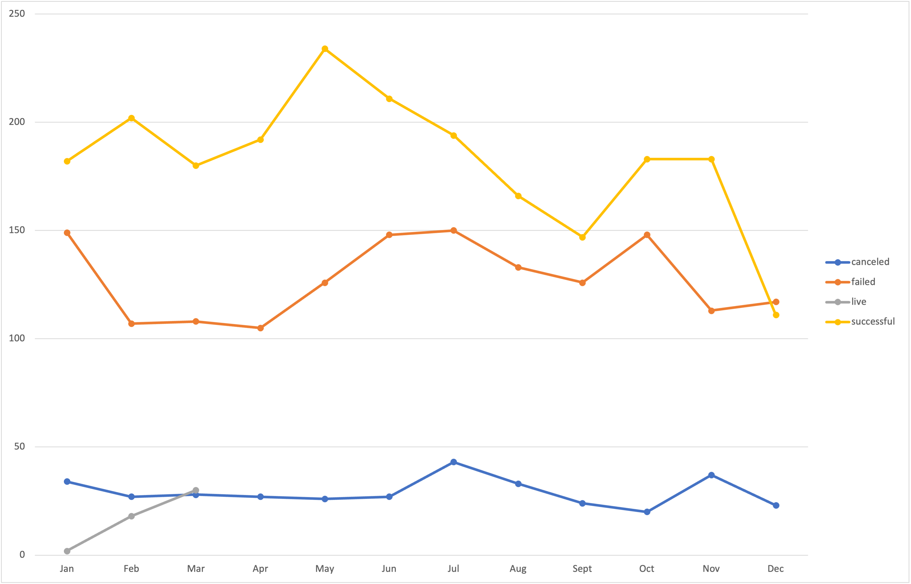
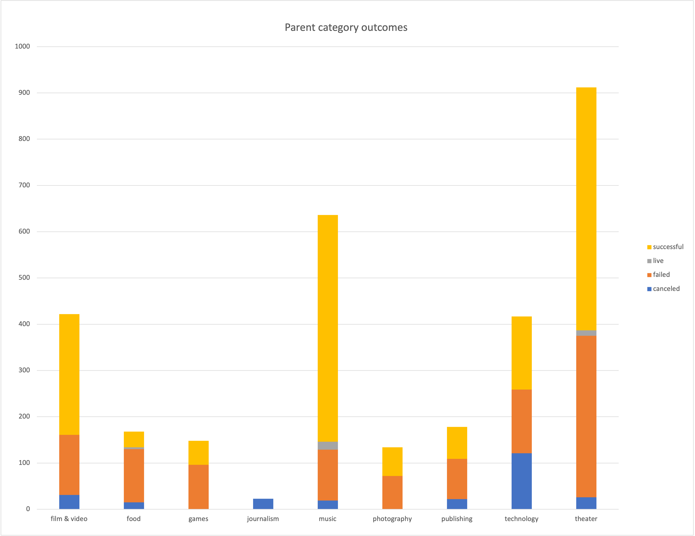
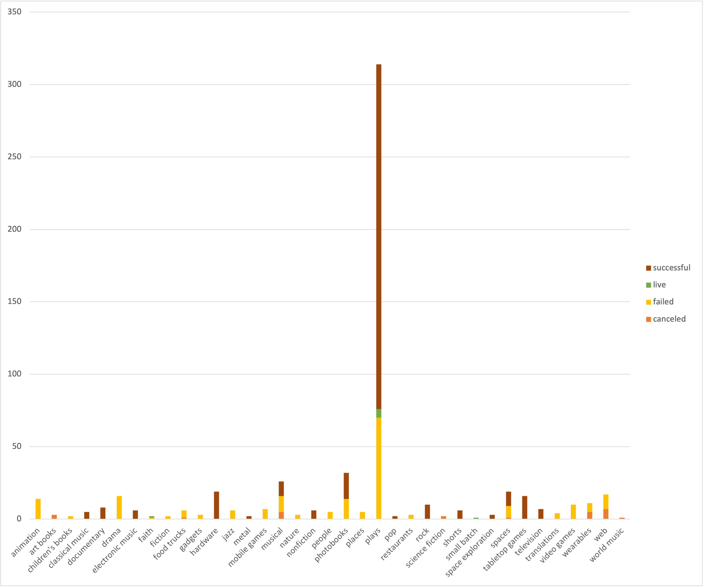
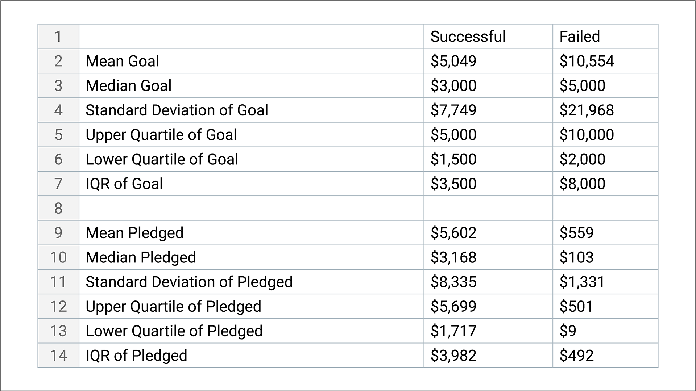
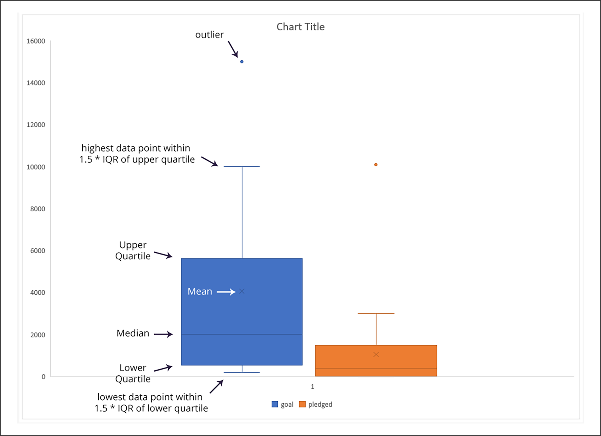
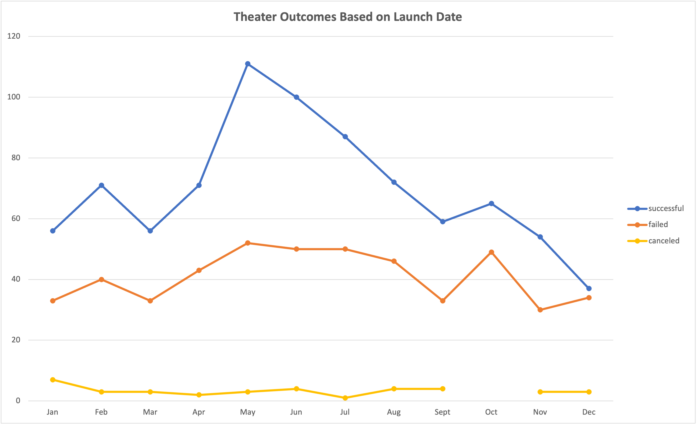
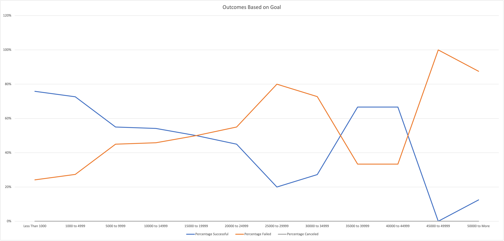

# An Analysis of Kickstarter Campaigns

## Performing data analysis on Croudfunding Projects to uncover trends.

## Overview of Project

### Louise wants to start a crowdfunding campaign to help fund her play "FEVER". She estimated a Budget of over $10,000 and is hestant to jump into her first fundraising campaign. She is looking for help to Organize, Sort and analyze crowdfunding data to determine specific factors that make projects campaign successful. We will be performing data analysis on crowd funding projects to uncover any hidden trends and provide insights and set her campaign to mirror other successful campaings in same category.

## Purpose of Project

### Purpose of this Project is to find out how different campaigns fared in relation to their launch date and their funding goals untilizing available kickstarter data.

## Analysis and Challenges

### Analysis of Outcomes Based on Campaign Length

*   The month that launched the most successful Kickstarter campaigns was May. However, January, June, July and October all had roughly the same number of failed campaigns launched. This can be determined by examining the points along the trend lines of the chart. 

### Analysis of Outcomes Based on Parent Category and Subcategory

* Theater is a popular and successful type of campaign overall. 

* Theater follows an overall trend: there is a spike of successful campaigns that began in June, but that tapers off by the end of the year. 

* By comparison, the data around technology campaigns reveals a different story. Instead of one large spike, their trend lines are a bit all over the place and less predictable.

### Analysis of Outcomes Based on Foresight Campaign in Great Britain

*   Foresight campaign was successful. It reached 100% of its goal -- it even went over by four dollars!
*   The average donation is surprisingly high, considering there are only 17 backers. Scrolling further, we can also see that the campaign wasn't active for very long—just under a month.

### Analysis based on United states Successful campaigns.

*  In United States there were 525 successful theater Kickstarters Campaigns.

### Analysis of Great Britain Campaigns.

*   We have found that while there are only a total of 604 Kickstarter campaigns for plays in Great Britain, the "theater" category is the most successful.

### Analysis based on central tendency: mean, median, and mode

*   Failed Kickstarter campaigns have much higher fundraising goals than successful Kickstarter campaigns. 

*   The mean and median pledged amounts are much lower than the successful pledges, which indicates that failed Kickstarter campaigns are unsuccessful for reasons other than asking for too much money. In other words, if the failed projects were also getting a median pledge amount of around $3,000, it's possible that those that failed just asked for too high of a price. Since the median is much lower, there must be another factor keeping people from pledging to those unsuccessful projects. 

### Analysis based on standard deviation and variance.

--   Based on these statistics, we can determine the following:

* The mean of each distribution is around the 3rd quartile, so the data follows similar distributions in each subset.

* The standard deviations are larger than the mean, which means everything below the mean is considered "close" to the center.

* Some large values are driving all of these distributions. The standard deviations are all roughly twice the IQR in each distribution, except in the failed Kickstarters, where the standard deviation is closer to three times the IQR. There must be some failed Kickstarters with really high goals!

### Analysis based on box plots using statistical computations

* The box shows the interquartile range with a line for the median and an "X" to indicate the mean. The whiskers show the extreme values within 1.5 times the interquartile range. Outliers are represented by labeled dots.

*   From these plots, we can see that the mean campaign goal is around £4,000. This is outside of the range of outliers for amount pledged, so Louise should probably try to get her play produced for less than £4,000. Half of the campaign goals are less than £2,000, which is just over the 3rd quartile for amounts pledged.

### Analysis of Outcomes Based on Launch Date

*   From this analysis we found that for parent category "Theater" the month of May launched most successful Kickstarter campaigns.

*   However, January, March, September and November and december all had roughly the same number of failed campaigns launched. 

*   The Theater campaign followed an overall trend: There is a spike of successful campaigns that began in May, but tapered off by the end of the year. 

*   The findings can be determined by examining the points along the trend lines of the given chart. 

### Analysis of Outcomes Based on Goals

*   From Outcomes based on Golas analysis it was determined that Failed Kickstarter campaigns have much higher fundraising goals than successful Kickstarter campaigns.

*   

### Challenges and Difficulties Encountered

## Results

- What are two conclusions you can draw about the Outcomes based on Launch Date?

- What can you conclude about the Outcomes based on Goals?

- What are some limitations of this dataset?

- What are some other possible tables and/or graphs that we could create?
